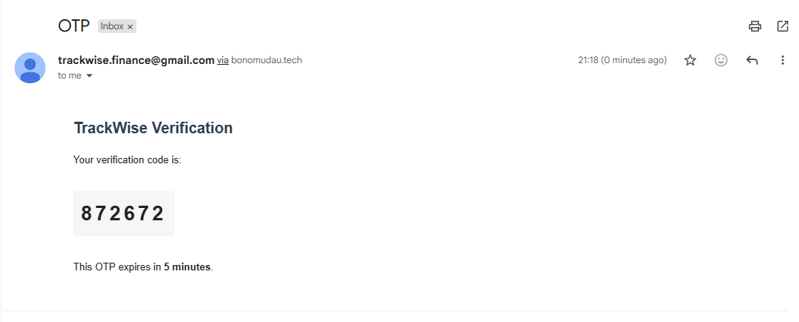
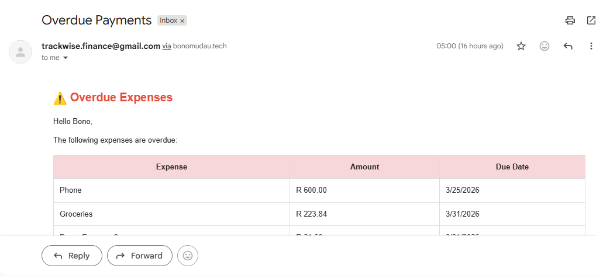
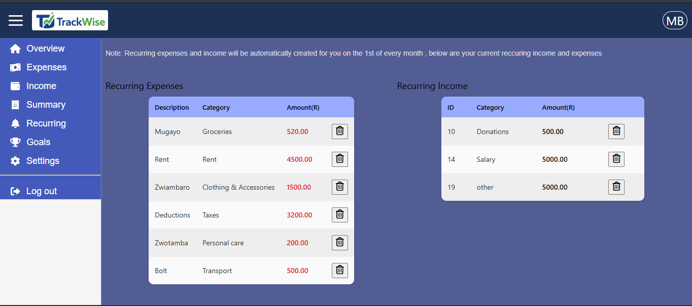
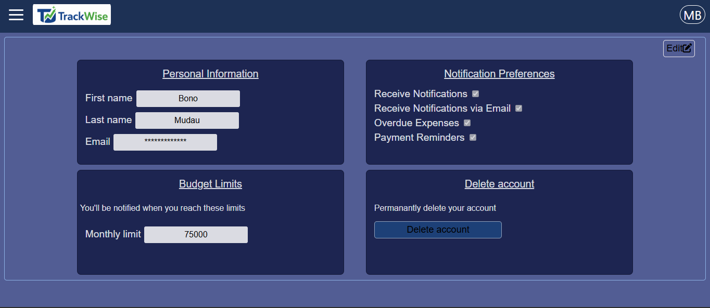
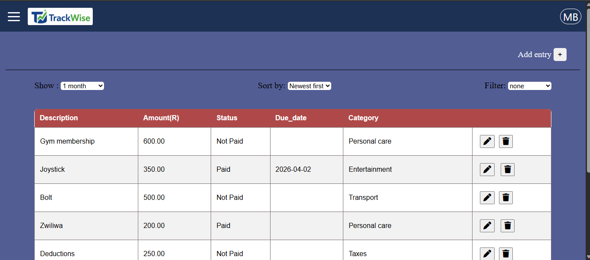
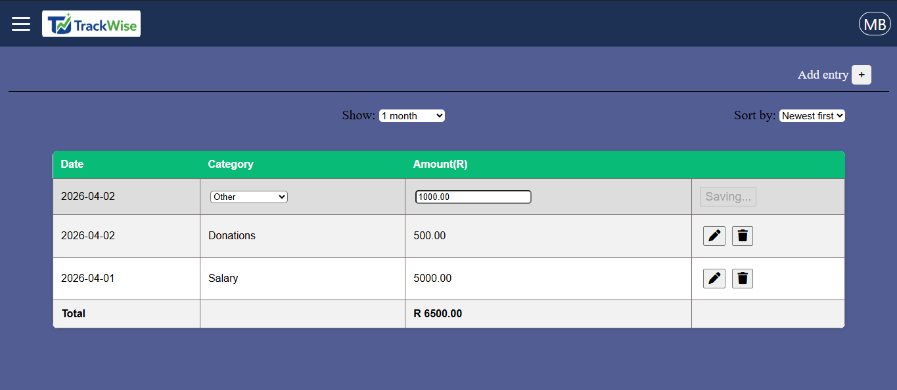
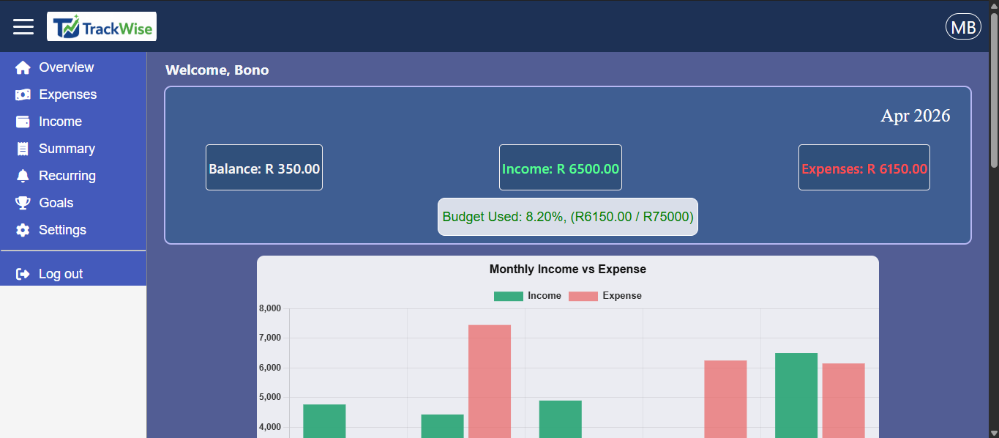
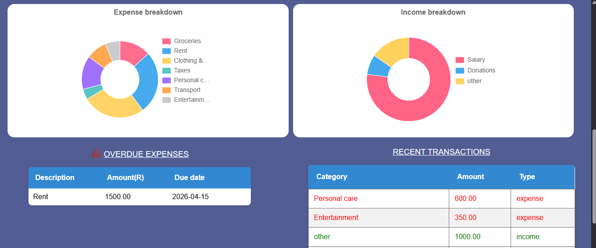
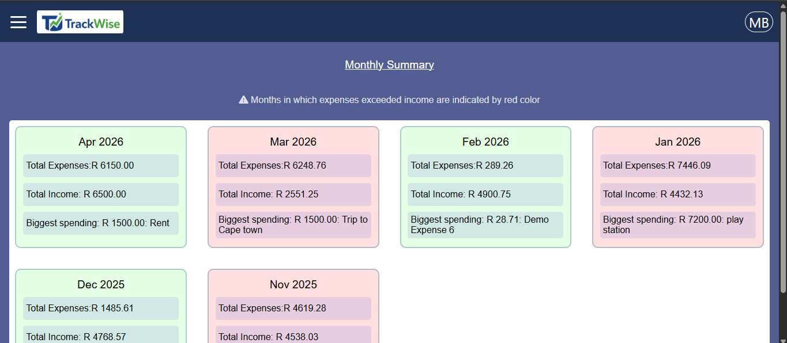

# 🧾 TrackWise

## 🚀 Overview
TrackWise is a full-stack personal finance management application that enables users to track income, manage expenses, and gain meaningful insights through a secure, automated, and real-time dashboard.

🌐 Live link: https://trackwise-9l4u.onrender.com

---

## ✨ Features

### 🔐 Authentication & Security
- JWT authentication (HTTP-only cookies)
- Token expiry (15 minutes) with automatic regeneration
- Protected API routes (post-login endpoints secured)
- Auto logout on invalid/expired tokens
- Password hashing using bcrypt
- OTP-based email verification
- Password recovery via OTP
- Rate limiting (brute-force protection)
- Security headers using Helmet

---

### 📧 Email & Notifications

- Mailgun integration
- OTP delivery for:
  - Signup verification
  - Password recovery
- Email notifications:
  - Account creation
  - Security alerts

---

### ⏰ Scheduled Tasks & Automation

- Daily background jobs (node-cron)
- Automated email reminders:
  - Upcoming payments (within 24 hours)
  - Overdue expenses

---

### 🔁 Recurring Transactions

- Mark income/expenses as recurring
- Automatically processed monthly
- Supports recurring income and expenses
---

### ⚙️ User Settings

- Update personal details (name, surname, email)
- Email preferences:
  - General emails
  - Overdue alerts
  - Payment reminders
- Monthly budget limit (default: R2000)
- Account deletion
---

### 💰 Expense Management

- Add, edit, delete expenses
- Categorize expenses
- Track payment status (paid/unpaid)
- Filter by:
  - Paid
  - Unpaid
  - Overdue
- View last 1–6 months
- Sort by:
  - Amount (asc/desc)
  - Date (asc/desc)
- Real-time updates

---

### 💵 Income Management

- Add, edit, delete income
- Categorize income sources
- View last 1–6 months
- Sort by:
  - Amount (asc/desc)
  - Date (asc/desc)
- Real-time updates

---

### 📊 Dashboard & Insights

#### Overview
- Current balance
- Total income & expenses
- Budget usage indicator:
  - Green (<85%)
  - Red (≥85%)
- Recent transactions (color-coded)
- Overdue expenses table

---

### 📈 Visualizations (Chart.js)

- Income vs Expense (last 6 months)
- Expense breakdown (pie chart)
- Income breakdown (pie chart)

---

### 📅 Monthly Summary

- Up to 6 previous months
- Each card includes:
  - Month & Year
  - Total income
  - Total expenses
  - Highest spending (amount + description)
- Visual indicators:
  - Green → income ≥ expenses
  - Red → expenses > income

---

### 📱 Responsive Design
- Works across desktop, tablet, and mobile

---

## 🧠 Tech Stack

### Backend
- Node.js
- Express.js

### Frontend
- HTML5
- CSS3
- JavaScript

### Database
- MySQL (Aiven Cloud)

### Tools & Libraries
- bcrypt
- jsonwebtoken (JWT)
- helmet
- express-rate-limit
- Chart.js
- Mailgun
- node-cron
- Git & GitHub

---

## 🏗 Architecture
- RESTful API design
- Modular structure (controllers, routes, middleware, services)
- Secure authentication flow
- Background job scheduling
- Separation of concerns

---

## 🔐 Security
- Cookie-based JWT authentication
- Input validation & sanitization
- Rate limiting
- Secure password hashing
- OTP verification flows
- Protected routes

